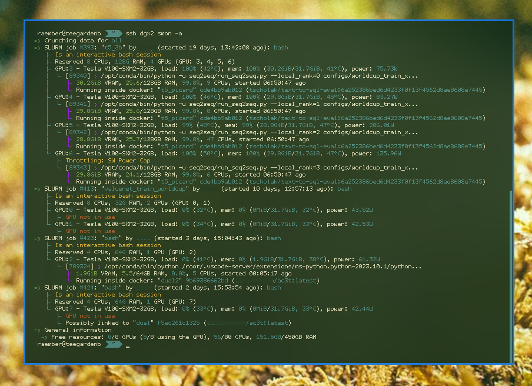

# SLURM information script



Gather information about the GPUs, running docker containers and SLURM jobs/sessions/batches to find how much of the resources are taken or if there are stale jobs that could be freed.

```shell
smon [-h] [-a] [-e] [-u USER] [-j JOBID]
```
